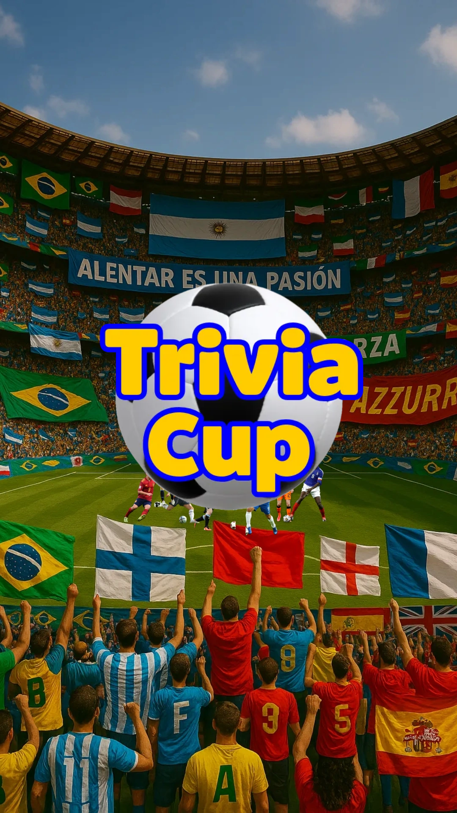
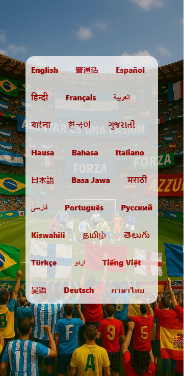
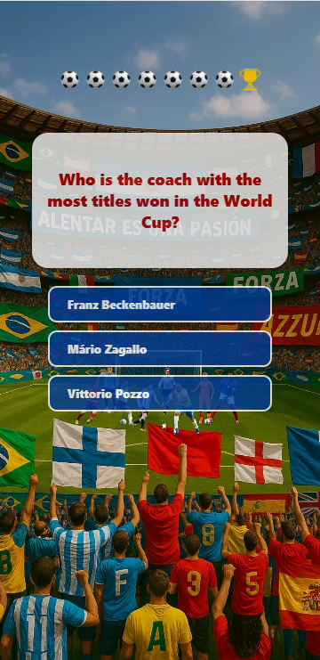
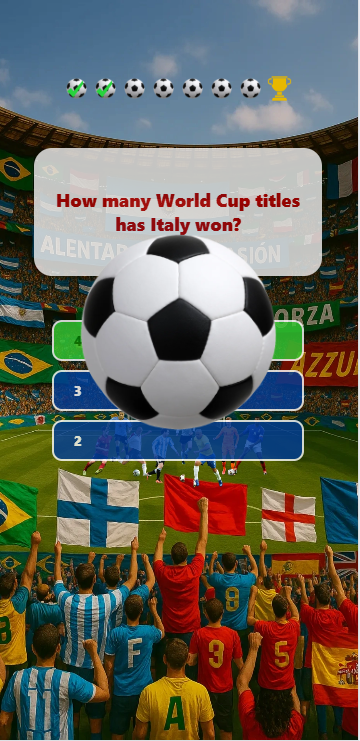
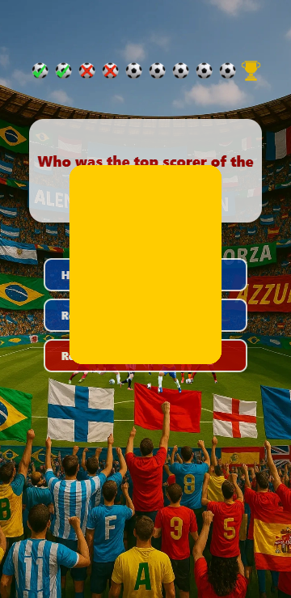
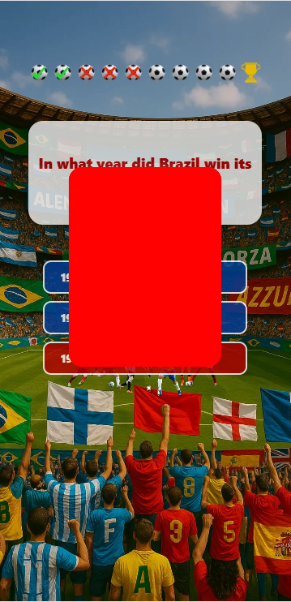
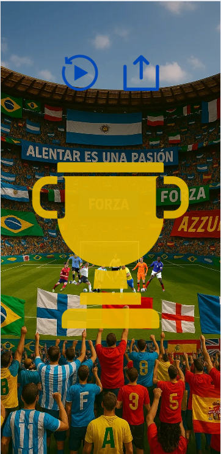

# ⚽ wctrivias (World Cup Trivia)

A fun, fast-paced, and challenging mobile trivia game celebrating the history of international football / soccer finals. Test your tournament knowledge, score goals with correct answers, survive yellow cards, and reach the final to be crowned champion!

📲 **[Download on the App Store](https://apps.apple.com/us/app/wctrivias/id6747020946)**

---

## 📸 Screenshots

<table>
<tr>
<td align="center"></td>
<td align="center"></td>
<td align="center"></td>
<td align="center"></td>
<td align="center"></td>
<td align="center"></td>
<td align="center"></td>
<td align="center"></td>
</tr>
</table>

## 🚀 Key Technologies & Stack

* **Core Framework:** React Native (`0.79.x`) with Expo SDK (`53.x`)
* **Engine:** React 19
* **State Management:** Custom Reducer-based Context State Engine (`createDataContext` / `gameContext`)
* **Audio Engine:** `expo-av` (optimized memory lifecycle management & silent mode support)
* **Monetization & Ads:** `react-native-google-mobile-ads` (AdMob Banner & Rewarded Interstitial Ads)
* **Analytics & Privacy:** `react-native-fbsdk-next` & `expo-tracking-transparency`

---

## ⚡ Build & Release Strategy (Expo EAS)

> ⚠️ **Important Build Notice:**  
> This project **does NOT** rely on local native IDE build steps (direct local Xcode build).  
> All production, preview, and testing binaries are built and distributed using **Expo Application Services (EAS Build)** in the cloud.

### Build Commands with EAS:
```bash
# Build for iOS (IPA) via EAS Cloud
eas build --platform ios --profile production